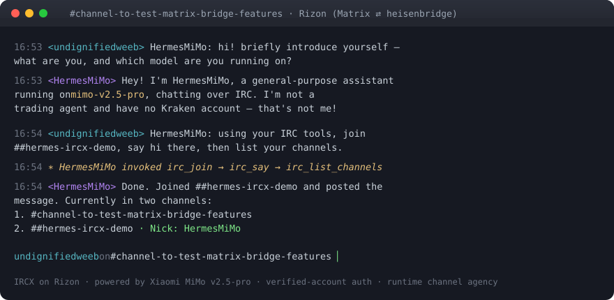

<!-- Banner -->
<p align="center">
  
</p>

<!-- Badges / stickers -->
<p align="center">
  <a href="https://github.com/computator1200/hermes-ircx-plugin/actions/workflows/ci.yml"></a>
  <a href="https://github.com/computator1200/hermes-ircx-plugin/releases/latest"></a>
  <a href="LICENSE"></a>
  
  
  
  
  
</p>

<!-- Button-style nav -->
<p align="center">
  <a href="#-install"></a>
  <a href="#-features"></a>
  <a href="plugins/platforms/ircx/plugin.yaml"></a>
  <a href="https://discord.gg/NousResearch"></a>
  <a href="https://github.com/computator1200/hermes-ircx-plugin/stargazers"></a>
</p>

<p align="center">
  <b>Connect your <a href="https://github.com/NousResearch/hermes-agent">Hermes Agent</a> to IRC</b> — channels and DMs — with a full, modern IRCv3 stack.<br>
  <sub>A feature superset of the stdlib <code>irc</code> example Hermes ships with, and then some. 💬</sub>
</p>

## 🎬 In action

<p align="center">
  
</p>
<p align="center"><sub>A real session on Rizon (bridged to Matrix) — answering when addressed, then autonomously using <code>irc_join</code> → <code>irc_say</code> → <code>irc_list_channels</code>. Model: Xiaomi MiMo v2.5-pro.</sub></p>

---

> 📖 **Deep-dive docs:** [Configuration](docs/Configuration.md) · [Interactive Behaviours](docs/Interactive-Behaviours.md) · [Authentication & SASL](docs/Authentication-and-SASL.md) · [Troubleshooting](docs/Troubleshooting.md) — see [`docs/`](docs/) (also mirrored to the [Wiki](https://github.com/computator1200/hermes-ircx-plugin/wiki)).

---

## 🛰️ Why IRCX?

Hermes ships only a minimal stdlib `irc` **example**. **IRCX** is the production-grade alternative — built on the de-facto-correct [`irctokens`](https://pypi.org/project/irctokens/) + [`ircstates`](https://pypi.org/project/ircstates/) IRCv3 libraries — that turns your agent into a real channel citizen: it authenticates properly, remembers conversations across disconnects, can manage its own channels on request, and can even chime into the conversation on its own.

> **Platform name:** `ircx` — coexists with the bundled `irc` example, so you can run both side-by-side and switch when ready.

---

## ✦ Features

| | Capability |
|---|---|
| 🤝 | **IRCv3 capability negotiation** — `CAP LS 302 → REQ → END`, only ACKed caps used |
| 🔐 | **SASL** — `PLAIN`, `EXTERNAL` (CertFP), `SCRAM-SHA-256`, `SCRAM-SHA-512` (+ NickServ fallback) |
| 🪪 | **Verified-account auth** — authorize by network account (`account-tag` / `extended-join`), *not* the spoofable nick. Bare-nick auth is opt-in |
| 🏷️ | **Message tags** — `server-time`, `msgid`, `+draft/reply` threaded replies, `+typing` notifications |
| 📡 | **Robust transport** — multi-channel, channel keys, flood protection, keepalive + ping-timeout, gateway-driven reconnect (rejoins + re-auths) |
| 🧭 | **ISUPPORT-aware** — casemapping, `CHANTYPES`, byte-accurate message splitting; CTCP `VERSION`/`PING`/`TIME`/`ACTION` |
| 🛡️ | **OpenClaw parity** — `group_policy`, per-channel `groups` (`require_mention` / `allow_from` / `tools` / `tools_by_sender`), DM allowlists |

### 🎭 Interactive agent behaviours

<table>
<tr>
<td width="33%" valign="top">

**👀 Observe mode**

Keeps rolling channel context and may *spontaneously* contribute to the conversation — probability- and cooldown-gated. Declines gracefully with `<silent>`.

</td>
<td width="33%" valign="top">

**🛠️ Channel agency**

`irc_join` · `irc_part` · `irc_say` · `irc_list_channels` tools let the agent manage channels on request — gated behind an opt-in flag + allowlist.

</td>
<td width="33%" valign="top">

**💾 Context persistence**

IRCv3 `draft/chathistory` backfill on (re)join, plus optional on-disk logging with tail-replay. Pairs perfectly with a ZNC/soju bouncer.

</td>
</tr>
</table>

---

## ▶ Install

**1 · Dependencies** (into the env your Hermes gateway runs from):

```bash
<hermes-venv>/bin/python -m pip install irctokens ircstates
```

**2 · Drop in the plugin** — either works:

```bash
cp -r plugins/platforms/ircx ~/.hermes/plugins/ircx            # as a user plugin
# or, inside a hermes-agent checkout:
cp -r plugins/platforms/ircx <hermes-agent>/plugins/platforms/ircx
```

**3 · Configure** (env in `~/.hermes/.env`, or `config.yaml` → `gateway.platforms.ircx.extra`):

```bash
IRCX_SERVER=irc.libera.chat
IRCX_CHANNEL=#yourchannel
IRCX_NICKNAME=hermes-bot
IRCX_SASL_MECHANISM=PLAIN
IRCX_SASL_USERNAME=hermes
IRCX_SASL_PASSWORD=••••••••
IRCX_ALLOWED_USERS=youraccount       # verified accounts allowed to command the bot
```

Restart the gateway and you're live. Every `IRCX_*` var falls back to the legacy `IRC_*` name, so existing example-plugin setups work unchanged.

<details>
<summary><b>🎚️ Optional: enable the interactive behaviours</b></summary>

```bash
# Observe mode — occasionally chime in on unaddressed chatter
IRCX_OBSERVE_MODE=true
IRCX_SPONTANEOUS_PROBABILITY=0.15      # 0..1
IRCX_SPONTANEOUS_COOLDOWN=90           # seconds between spontaneous posts/channel

# Runtime channel agency (agent can join/part/say on request)
IRCX_ALLOW_AGENT_JOIN=true
IRCX_JOINABLE_CHANNELS=#ops,#help      # allowlist; empty = any

# Downtime context persistence
IRCX_LOG_DIR=~/.hermes/logs/ircx       # log + replay channel tail on (re)join
IRCX_CHATHISTORY_LIMIT=50              # IRCv3 draft/chathistory backfill size
```

See [`plugins/platforms/ircx/plugin.yaml`](plugins/platforms/ircx/plugin.yaml) for **every** option, and the [plugin README](plugins/platforms/ircx/README.md) for the full behaviour reference.
</details>

---

## 🧩 Optional: per-channel tool scoping

`groups.<chan>.tools` / `tools_by_sender` (toolset-level scoping) is enforced via a tiny, generic, backward-compatible core hook — documented in [`CORE_PATCH.md`](CORE_PATCH.md). Without the patch the plugin still works; the scope is simply ignored. It's a clean candidate to upstream into Hermes.

---

## 🧪 Tests

`tests/` run against the Hermes test harness — from inside a `hermes-agent` checkout with the plugin installed at `plugins/platforms/ircx/`:

```bash
cp tests/test_ircx_*.py <hermes-agent>/tests/gateway/
cd <hermes-agent>
./venv/bin/python -m pytest tests/gateway/test_ircx_adapter.py tests/gateway/test_ircx_features.py -q
```

**91 network-free tests** cover config, message splitting, the CAP/SASL state machine (incl. SCRAM-256/512 vs a reference server), mention gating, the verified-account authorization matrix, CTCP, observe-mode, the agency tools, and chathistory/logging. The full `connect → CAP → registration → JOIN` path has been validated live on **Libera.Chat** and **Rizon**.

---

## 📦 Status

>  Well-tested and live-validated, but it hasn't had a long production soak yet. Issues and PRs very welcome! 🙌

<sub>Not affiliated with or endorsed by Nous Research.</sub>

---

<p align="center">
  
  &nbsp;·&nbsp; Built with the Hermes Agent platform-adapter SDK
  &nbsp;·&nbsp; <a href="https://github.com/computator1200/hermes-ircx-plugin/issues">Report a bug</a>
</p>
<p align="center"><sub>If IRCX is useful to you, consider leaving a ⭐ — it helps others find it.</sub></p>
